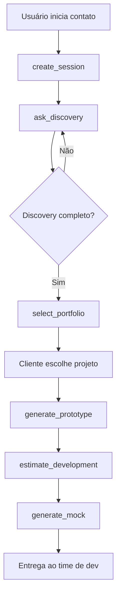

# 🛠️ POLARIS Tools - Índice Visual

## ✅ Status: Todas as 7 tools validadas e funcionais!

---

## 📦 Tools Disponíveis

### 1. 🆕 **create_session**
**Propósito**: Criar nova sessão de conversa  
**Arquivo**: [`tools/create_session/`](./create_session/)

**Quando usar**: No início de cada interação  
**Retorna**: `session_id`, `client_id`, `created_at`

```json
{
  "client_id": "user_123",
  "metadata": {"source": "website"}
}
```

---

### 2. 🏥 **health_check**
**Propósito**: Verificar saúde do sistema  
**Arquivo**: [`tools/health_check/`](./health_check/)

**Quando usar**: Diagnóstico ou antes de operações críticas  
**Retorna**: Status de LLM, embeddings, database

```json
{
  "check_embeddings": true,
  "check_database": true
}
```

---

### 3. 💬 **ask_discovery**
**Propósito**: Processar mensagens e extrair informações  
**Arquivo**: [`tools/ask_discovery/`](./ask_discovery/)

**Quando usar**: Durante todo o processo de discovery  
**Extrai**: `pain`, `users`, `kpi`, `budget`  
**Retorna**: `next_question`, `slots`, `complete`

```json
{
  "session_id": "uuid-here",
  "message": "Quero criar um e-commerce..."
}
```

---

### 4. 🎯 **select_portfolio**
**Propósito**: Buscar projetos relevantes (RAG)  
**Arquivo**: [`tools/select_portfolio/`](./select_portfolio/)

**Quando usar**: Após coletar informações no discovery  
**Retorna**: Lista de projetos com score e rationale

```json
{
  "query": "e-commerce mobile B2C",
  "top_k": 5,
  "filters": {"max_budget": 50000}
}
```

---

### 5. 📄 **generate_prototype**
**Propósito**: Gerar documentação técnica em Markdown  
**Arquivo**: [`tools/generate_prototype/`](./generate_prototype/)

**Quando usar**: Após cliente escolher projeto  
**Retorna**: Documento Markdown completo

```json
{
  "session_id": "uuid-here",
  "choice_id": 1,
  "context": {
    "features": ["Login", "Checkout", "Dashboard"]
  }
}
```

---

### 6. 🎲 **generate_mock**
**Propósito**: Gerar dados de exemplo JSON  
**Arquivo**: [`tools/generate_mock/`](./generate_mock/)

**Quando usar**: Para auxiliar desenvolvimento com dados de teste  
**Retorna**: Lista de mocks validados

```json
{
  "session_id": "uuid-here",
  "contract_name": "User",
  "count": 10,
  "include_invalid": true
}
```

---

### 7. ⏱️ **estimate_development**
**Propósito**: Estimar esforço de desenvolvimento  
**Arquivo**: [`tools/estimate_development/`](./estimate_development/)

**Quando usar**: Para planejamento e precificação  
**Retorna**: Horas totais, breakdown, t-shirt size (S/M/L/XL)

```json
{
  "session_id": "uuid-here",
  "features": ["Login", "Dashboard", "API REST"],
  "include_buffer": true
}
```

---

## 🔄 Fluxo Típico de Uso



---

## 📊 Estatísticas

- **Total de tools**: 7
- **Linhas de código**: ~1500
- **Arquivos JSON**: 7
- **Arquivos Python**: 7
- **Cobertura de testes**: 0% (TODO)

---

## 🧪 Validação

Execute o validador para verificar todas as tools:

```bash
python3 tools/validate_tools.py
```

---

## 📚 Documentação Adicional

- [README completo](./README.md) - Documentação detalhada
- [Exemplo de uso](./example_usage.py) - Script demonstrativo
- [Validador](./validate_tools.py) - Script de validação

---

## 🎯 Próximos Passos

- [ ] Adicionar testes unitários para cada tool
- [ ] Integrar com OpenAI/Anthropic real
- [ ] Adicionar tool para consultar histórico de conversas
- [ ] Adicionar tool para atualizar slots manualmente
- [ ] Implementar cache de embeddings
- [ ] Adicionar métricas de uso das tools

---

**Última atualização**: 11 de novembro de 2025  
**Status**: ✅ Produção Ready
